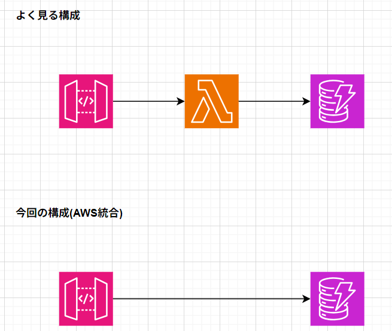
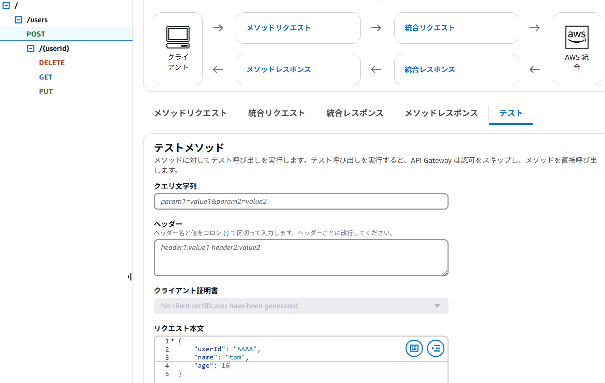
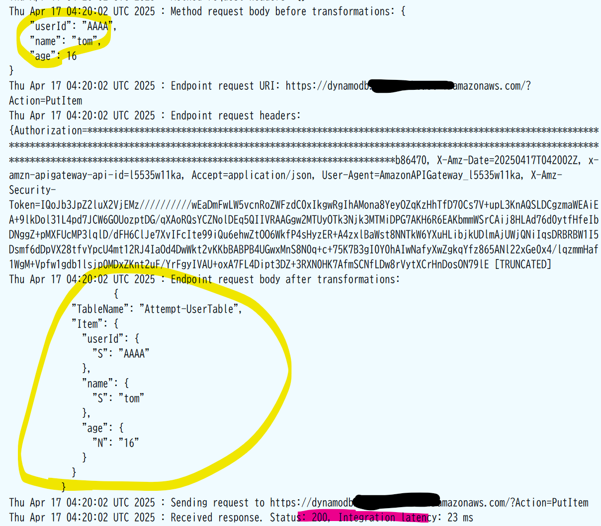
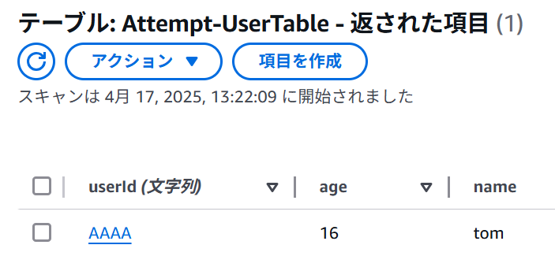
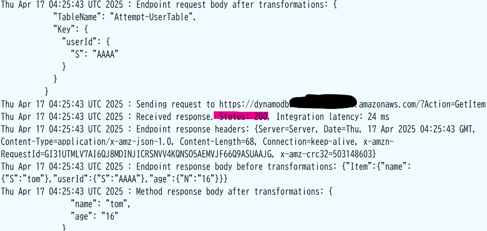
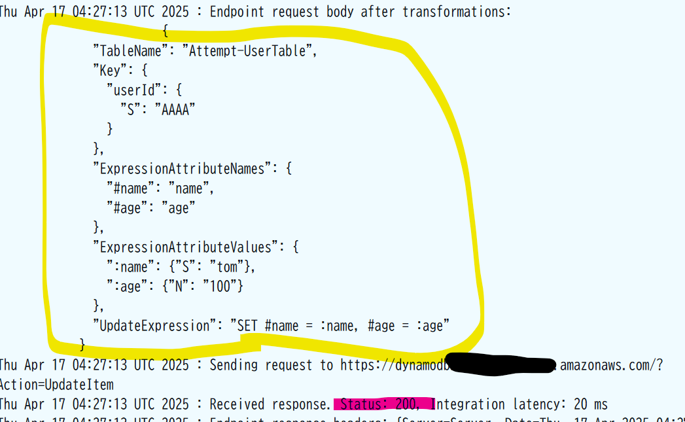
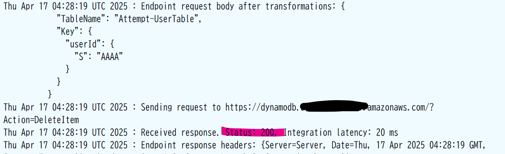

# 概要
こんにちは、クラスメソッド製造ビジネステクノロジー部の田中聖也です  
意外と知られていないですが、[AWS統合](https://docs.aws.amazon.com/ja_jp/apigateway/latest/developerguide/api-gateway-api-integration-types.html)を使用することでAPIGatewayからDynamoDBやS3を直接操作出来ることはご存知でしょうか?  
今回はAPIGatewayからLmabdaを経由せず、直接DynamoDBに対してCRUD操作を実施したいと思います  
  

# やってみた
## CDK
本来は統合レスポンスを定義する必要がありますが、今回ここは省略します  
とりあえず、APIGatewayからDynamoDBが操作出来るのを目標とします  
```typescript:stack.ts
import * as cdk from 'aws-cdk-lib';
import { Construct } from 'constructs'
import { 
  aws_apigateway,
  aws_dynamodb,
  aws_iam,
  RemovalPolicy
 } from 'aws-cdk-lib';

const PREFIX = 'Attempt';

export class AttemptStackStack extends cdk.Stack {
  constructor(scope: Construct, id: string, props?: cdk.StackProps) {
    super(scope, id, props);

    const userTable = new aws_dynamodb.Table(this, `${PREFIX}-UserTable`,{
      tableName: `${PREFIX}-UserTable`,
      partitionKey: {name: 'userId', type: aws_dynamodb.AttributeType.STRING},
      billingMode: aws_dynamodb.BillingMode.PAY_PER_REQUEST,
      removalPolicy: RemovalPolicy.DESTROY
    });

    const apiGatewayExecRole = new aws_iam.Role(this, `${PREFIX}-ApiGateway-Role`, {
      roleName: `${PREFIX}-ApiGateway-Role`,
      assumedBy: new aws_iam.ServicePrincipal("apigateway.amazonaws.com"),
    });
    const apiGatewayPolicy = new aws_iam.Policy(this, `${PREFIX}-ApiGateway-Policy`, {
      statements: [
        new aws_iam.PolicyStatement({
          actions: ["dynamodb:GetItem", "dynamodb:PutItem", "dynamodb:UpdateItem", "dynamodb:DeleteItem"],
          effect: aws_iam.Effect.ALLOW,
          resources: [userTable.tableArn]
        })
      ]
    });
    apiGatewayExecRole.attachInlinePolicy(apiGatewayPolicy);

    const api = new aws_apigateway.RestApi(this, `${PREFIX}-Api`, {
      restApiName: `${PREFIX}-Rest-Api`,
      description: 'Attempt API'
    });

    const usersResource = api.root.addResource('users');

    const createUserModel = api.addModel('CreateUserModel', {
      schema: {
        type: aws_apigateway.JsonSchemaType.OBJECT,
        properties: {
          userId: {type: aws_apigateway.JsonSchemaType.STRING},
          name: {type: aws_apigateway.JsonSchemaType.STRING},
          age: {type: aws_apigateway.JsonSchemaType.NUMBER}
        },
        required: ['userId', 'name', 'age']
      }
    });

    const updateUserModel = api.addModel('UpdateUserModel', {
      schema: {
        type: aws_apigateway.JsonSchemaType.OBJECT,
        properties: {
          name: {type: aws_apigateway.JsonSchemaType.STRING},
          age: {type: aws_apigateway.JsonSchemaType.NUMBER}
        },
        required: ['name', 'age']
      }
    });

    // Note: ユーザー作成
    const postUserIntegration = new aws_apigateway.AwsIntegration({
      region: this.region,
      service: 'dynamodb',
      action: 'PutItem',
      integrationHttpMethod: 'POST',
      options: {
        credentialsRole: apiGatewayExecRole,
        requestTemplates: {
          'application/json': `
          #set($inputRoot = $input.path('$'))
          {
            "TableName": "${userTable.tableName}",
            "Item": {
              "userId": {
                "S": "$inputRoot.userId"
              },
              "name": {
                "S": "$inputRoot.name"
              },
              "age": {
                "N": "$inputRoot.age"
              }
            }
          }`
        },
      }
    });

    usersResource.addMethod('POST', postUserIntegration,
      {
        requestModels: {
          'application/json': createUserModel
        },
        methodResponses: [
          {statusCode: '201'}
        ]
      }
    );

    // Note: ユーザー情報取得
    const getUserIntegration = new aws_apigateway.AwsIntegration({
      region: this.region,
      service: 'dynamodb',
      action: 'GetItem',
      integrationHttpMethod: 'POST',
      options: {
        credentialsRole: apiGatewayExecRole,
        requestTemplates: {
          'application/json': `{
            "TableName": "${userTable.tableName}",
            "Key": {
              "userId": {
                "S": "$input.params('userId')"
              }
            }
          }`
        },
        integrationResponses: [
          {
            statusCode: '200',
            responseTemplates: {
              'application/json': `{
                "name": "$input.path('$').Item.name.S",
                "age": "$input.path('$').Item.age.N"
              }`
            }
          }
        ]
      }
    });

    // Note: ユーザー削除
    const deleteUserIntegration = new aws_apigateway.AwsIntegration({
      region: this.region,
      service: 'dynamodb',
      action: 'DeleteItem',
      integrationHttpMethod: 'POST',
      options: {
        credentialsRole: apiGatewayExecRole,
        requestTemplates: {
          'application/json': `{
            "TableName": "${userTable.tableName}",
            "Key": {
              "userId": {
                "S": "$input.params('userId')"
              }
            }
          }`
        }
      }
    });

    // Note: ユーザー更新
    const putUserIntegration = new aws_apigateway.AwsIntegration({
        region: this.region,
        service: 'dynamodb',
        action: 'UpdateItem',
        integrationHttpMethod: 'POST',
        options: {
          credentialsRole: apiGatewayExecRole,
          requestTemplates: {
            'application/json': `
            #set($inputRoot = $input.path('$'))
            {
              "TableName": "${userTable.tableName}",
              "Key": {
                "userId": {
                  "S": "$input.params('userId')"
                }
              },
              "ExpressionAttributeNames": {
                "#name": "name",
                "#age": "age"
              },
              "ExpressionAttributeValues": {
                ":name": {"S": "$inputRoot.name"},
                ":age": {"N": "$inputRoot.age"}
              },
              "UpdateExpression": "SET #name = :name, #age = :age"
            }`
          }
        }
    });

    const userIdResource = usersResource.addResource('{userId}');
    userIdResource.addMethod('GET', getUserIntegration, 
      {
        methodResponses: [
          {statusCode: '200'}
        ]
      }
    );
    userIdResource.addMethod('PUT', putUserIntegration,
      {
        requestModels: {
          'application/json': updateUserModel
        },
        methodResponses: [
          {statusCode: '200'}
        ]
      }
    );
    userIdResource.addMethod('DELETE', deleteUserIntegration,
      {
        methodResponses: [
          {statusCode: '204'}
        ]
      }
    );
  }
}

```

## ユーザー作成
作成されたAPIGatewayからユーザーを作成してみます  
  
  
なんか、リクエストが通っていそうですね  
  
  
実際にDynamoDBを確認すると指定したパラメーターでユーザーが作成されているのが分かります  
  

## ユーザー取得
  
## ユーザー更新

## ユーザー削除
  

# まとめ
APIGatewayから直接DynamoDBに対してCRUD操作が出来ることを確認しました  
単体操作だけでなく[TransactWriteItems](https://docs.aws.amazon.com/ja_jp/amazondynamodb/latest/APIReference/API_TransactWriteItems.html)なども利用出来るので、色んな場面で使用できそうですね  