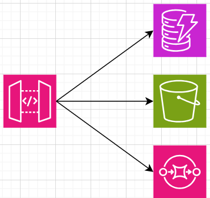
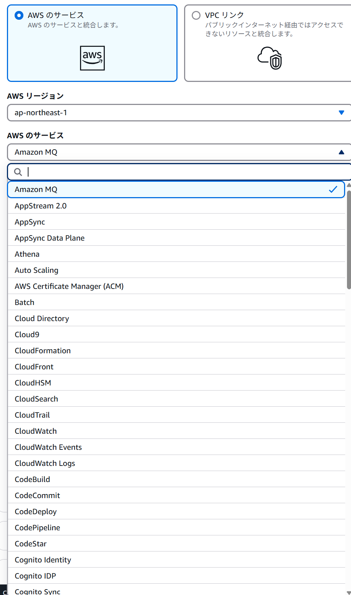
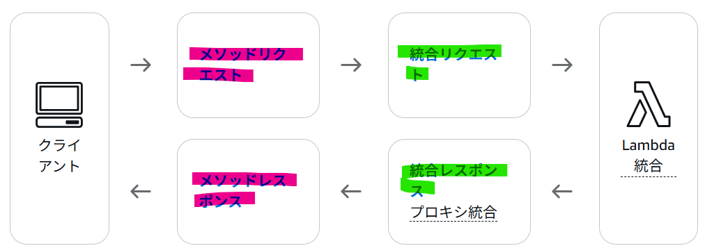
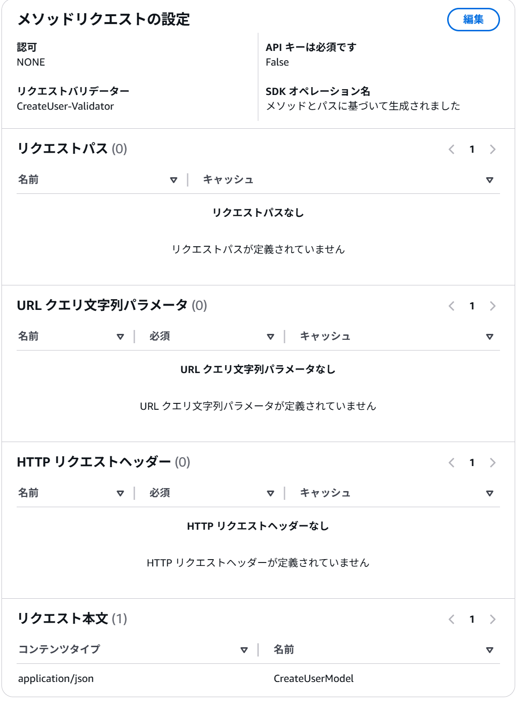
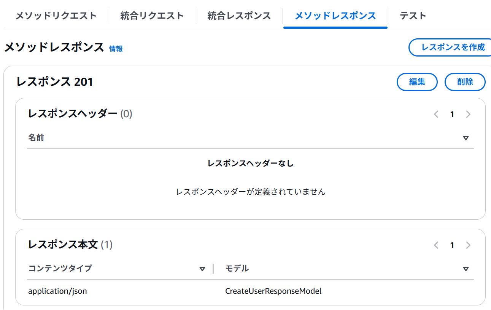
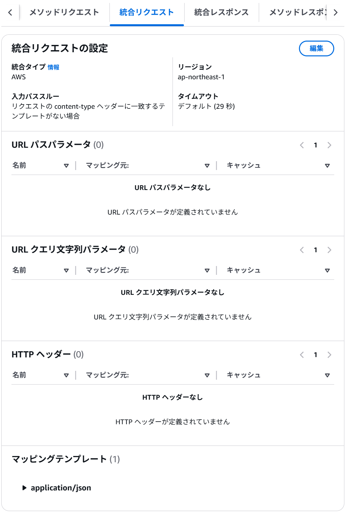
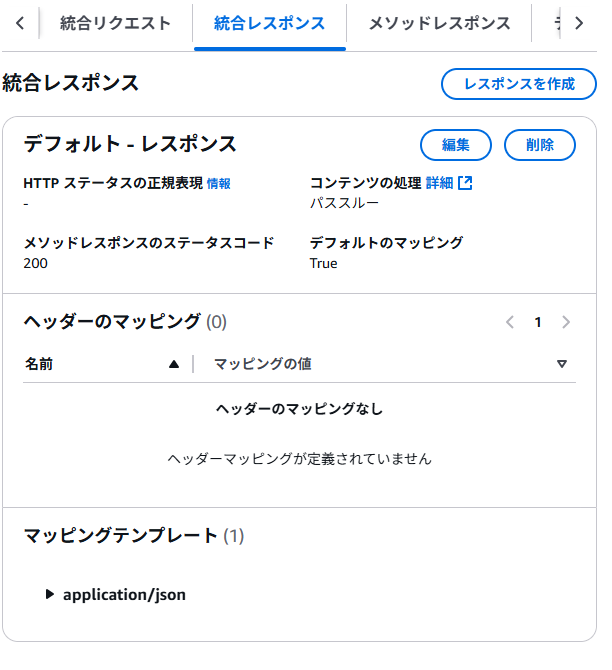
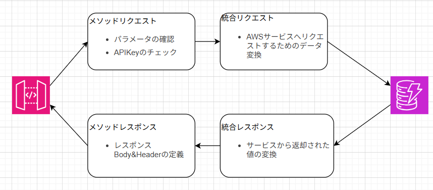

# 概要
こんにちは、クラスメソッド製造ビジネステクノロジー部の田中聖也です  
過去の記事でAWS統合の使用方法を書きましたが、今回はAWS統合の内容を整理して理解を深めたいと思います  

# AWS統合とは
AWSのサイトでいい感じの説明が見つからなかったのでAPIGatewayのAWS統合についての質問をAmazonQに投げて、得た回答の概要が↓のような感じです  
- APIGatewayから様々なAWSサービスに直接接続できる
- カスタムバックエンドを必要とせず、API が AWS サービスと連携できるようになる
- 統合リクエストと統合レスポンスの両方を設定する必要がある
- AWS サービスとやり取りするために適切な権限が必要
- 統合対象の AWS サービスが期待する形式に合わせて、受信リクエストを変換できる
- AWS サービスからのレスポンスをどのように処理および変換するかを設定できる
- さまざまな種類のエラーに対して、カスタムエラーレスポンスを設定できる

色々と分からない部分もあるので分解しながら理解していきます

# AWSサービスとの連携
言葉の通りでAPIGatewayから様々なAWSサービスと連携することができます  
  
コンソールで確認すると結構な数のAWSサービスと連携できるようです(すごい)  
  
よくあるのがAPIGatewayからLambdaを経由するパターンも多いですが、APIGatewayから直接操作できるようですね  

# リクエストとレスポンス
APIGatewayには以下4つのリクエストとレスポンス内容があります  
- メソッドリクエスト
- 統合リクエスト
- メソッドレスポンス
- 統合レスポンス
  
  
それぞれを簡単に説明していきます  
## メソッドリクエスト/レスポンス
定義したメソッドが何を受け取って何を返却するのかを定義する部分です  
### メソッドリクエスト
- 認可処理
- APIキーの確認
- リクエストモデルの定義(bodyパターンの簡易バリデーション)
- クエリパラメータの簡易チェック
  
  

### メソッドレスポンス
- レスポンスbodyの定義
- レスポンスheaderの定義
  
  

## 統合リクエスト/レスポンス
連携するAWSサービスへのリクエスト、レスポンス内容の変換
### 統合リクエスト
- 連携するAWSサービスにどのような情報を渡すのか変換

  
### 統合レスポンス
- 連携したAWSサービスから返ってきた値(ステータスコードやbody)の変換    

## 図解
今までの流れを1つの図に表すと以下のようになります  
  
- メソッドリクエスト/メソッドレスポンス: ユーザー(連携先のサービス)を対象としたデータの変換
- 統合リクエスト/統合レスポンス: AWSサービスを対象としたデータの変換

# まとめ
今回はざっくりとですが、AWS統合について解説しました  
次回は統合リクエストなどに設定できるパラメータを活用してもうちょっと詳しく解説したいと思います  
APIGatewayの機能をフル活用していきいましょう!!