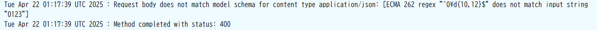

# 概要
こんにちは、クラスメソッド製造ビジネステクノロジー部の田中聖也です  
REST APIでPostメソッドやPutメソッドを使用すると必ず一緒にしなければならないのが、bodyパラメータのバリデーションです  
バリデーションの方法としてlambdaで実施することも出来ますが、バリデーション内容が複雑だとテストケースも増えてきます  
そこで、できることはAPIGatewayのデータモデルを定義してバリデーションをしてあげようと思います  
  

# やってみた
## バリデーション内容
今回はユーザーを作成するAPIで考えます  
パラメータ情報およびバリデーション内容は以下のものとします  
| 項目 | データ型 | 制約 | 必須項目 |
| :-- | :-- | :-- | :-- |
| userId | string | 16文字 | 〇 |
| name | string | 1文字以上20文字未満 | 〇 |
| age | number | 15以上100未満 | 〇 |
| phoneNumber | string | 0始まりの11桁以上14桁未満 | × |
## CDK
```typescript:stack.ts
import * as cdk from 'aws-cdk-lib';
import { Construct } from 'constructs'
import { 
  aws_apigateway,
  aws_dynamodb,
  aws_iam,
  RemovalPolicy,
  aws_lambda,
  aws_lambda_nodejs
 } from 'aws-cdk-lib';

const PREFIX = 'Attempt';

export class AttemptStackStack extends cdk.Stack {
  constructor(scope: Construct, id: string, props?: cdk.StackProps) {
    super(scope, id, props);

    const userTable = new aws_dynamodb.Table(this, `${PREFIX}-UserTable`,{
      tableName: `${PREFIX}-UserTable`,
      partitionKey: {name: 'userId', type: aws_dynamodb.AttributeType.STRING},
      billingMode: aws_dynamodb.BillingMode.PAY_PER_REQUEST,
      removalPolicy: RemovalPolicy.DESTROY
    });

    const apiGatewayExecRole = new aws_iam.Role(this, `${PREFIX}-ApiGateway-Role`, {
      roleName: `${PREFIX}-ApiGateway-Role`,
      assumedBy: new aws_iam.ServicePrincipal("apigateway.amazonaws.com"),
    });
    const apiGatewayPolicy = new aws_iam.Policy(this, `${PREFIX}-ApiGateway-Policy`, {
      statements: [
        new aws_iam.PolicyStatement({
          actions: ["dynamodb:PutItem"],
          effect: aws_iam.Effect.ALLOW,
          resources: [userTable.tableArn]
        })
      ]
    });
    apiGatewayExecRole.attachInlinePolicy(apiGatewayPolicy);

    const api = new aws_apigateway.RestApi(this, `${PREFIX}-Api`, {
      restApiName: `${PREFIX}-Rest-Api`,
      description: 'Attempt API'
    });

    const usersResource = api.root.addResource('users');

    // bodyのパラメータバリデーションモデル
    const createUserModel = api.addModel(`${PREFIX}-CreateUserModel`, {
      contentType: 'application/json',
      modelName: 'CreateUserModel',
      schema: {
        title: 'CreateUserModel',
        type: aws_apigateway.JsonSchemaType.OBJECT,
        properties: {
          userId: {type: aws_apigateway.JsonSchemaType.STRING, minLength: 16, maxLength: 16},
          name: {type: aws_apigateway.JsonSchemaType.STRING, minLength: 1, maxLength: 16},
          age: {type: aws_apigateway.JsonSchemaType.NUMBER, minimum: 15, maximum: 99},
          phoneNumber: {type: aws_apigateway.JsonSchemaType.STRING, pattern: '^0\\d{10,12}$'}
        },
        required: ['userId', 'name', 'age']
      }
    });

    const handler = new aws_lambda_nodejs.NodejsFunction(this,  `${PREFIX}-Handler`, {
      functionName: `${PREFIX}-Handler`,
      runtime: aws_lambda.Runtime.NODEJS_20_X,
      entry: 'lambda/index.ts',
      handler: 'handler',
    });

    userTable.grantReadWriteData(handler);

    // Note: リクエストパラメータのバリデーションを設定
    const createUserValidator = new aws_apigateway.RequestValidator(this, `${PREFIX}-CreateUser-Validator`, {
      restApi: api,
      requestValidatorName: 'CreateUser-Validator',
      validateRequestBody: true,
      validateRequestParameters: true
    })

    usersResource.addMethod('POST', new aws_apigateway.LambdaIntegration(handler),
      {
        requestModels: {
          'application/json': createUserModel // 設定したバリデーションモデルを紐づけ
        },
        requestValidator: createUserValidator, // 設定したリクエストバリデーションを紐づけ
        methodResponses: [
          {statusCode: '201'}
        ]
      }
    );
  }
}
```
## 検証
### 全てOKの場合
#### リクエスト内容
```json:request.json
{
    "userId": "AAAABBBBCCCCDDDD",
    "name": "tom",
    "age": 20,
    "phoneNumber": "012345678901"
}
```
#### レスポンス


### userIdが不正な値
#### リクエスト内容
```json:request.json
{
    "userId": "ABCD",
    "name": "tom",
    "age": 20,
    "phoneNumber": "012345678901"
}
```
#### レスポンス


### nameが不正な値
#### リクエスト内容
```json:request.json
{
    "userId": "AAAABBBBCCCCDDDD",
    "name": "",
    "age": 20,
    "phoneNumber": "012345678901"
}
```
#### レスポンス


### ageが不正な値
#### リクエスト内容
```json:request.json
{
    "userId": "AAAABBBBCCCCDDDD",
    "name": "tom",
    "age": 1500,
    "phoneNumber": "012345678901"
}
```
#### レスポンス


### phoneNumberが不正な値
#### リクエスト内容
```json:request.json
{
    "userId": "AAAABBBBCCCCDDDD",
    "name": "tom",
    "age": 20,
    "phoneNumber": "0123"
}
```
#### レスポンス


### ageとphoneNumberが不正な値
#### リクエスト内容
```json:request.json
{
    "userId": "AAAABBBBCCCCDDDD",
    "name": "tom",
    "age": 1500,
    "phoneNumber": "0123"
}
```
#### レスポンス
ageとphoneNumberの両方が不正な値であることが確認できますね  
ちょっと前まで1つしか表示されない記憶があったのですが、アップデートされたのかな。。。  


# まとめ
APIGatewayで入力値をバリデーションできることを確認できました  
難しい部分はlambdaで実行する必要がありますが、簡単な内容であればAPIGatewayの機能を活用してローコード化していきたいですね  