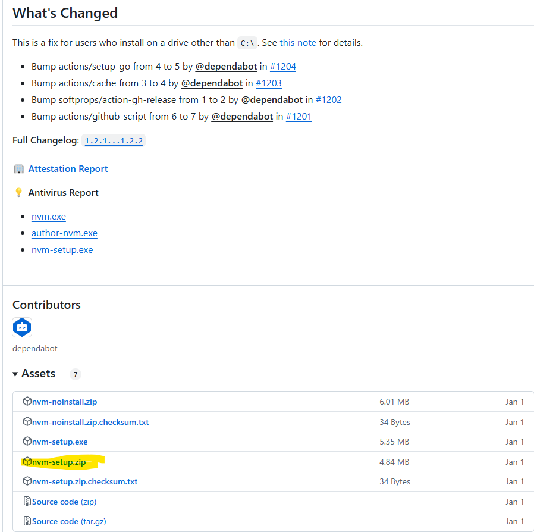
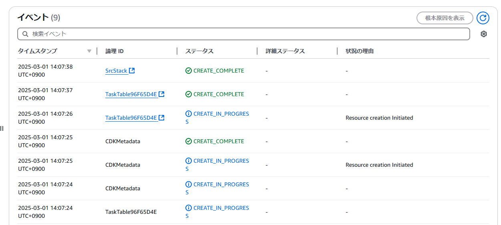

# 概要
Windows11でCDKでデプロイできるまでの手順をまとめます  
## 記事の対象者
- これからWindows11でcdkを使いたい人
- npmを使用してCDKをinstallしたい人
## ざっくりとした手順
1. AWS CLI用のIAMユーザーを作成
2. AWS CLIのinstallと設定
3. nvmをinstallしてNodeのversion指定
4. CDKをinstallと実行

# 1. AWS CLI用のIAMユーザーを作成
*この工程はAWSコンソールで実施します  
1. IAMからユーザーを選択
2. 「ユーザーの作成」をクリック
3. 「ユーザー名」を適当に入力して、「次へ」をクリック
   1. 「AWS マネジメントコンソールへのユーザーアクセスを提供する - オプション」は何もしない
4. 「ポリシーを直接アタッチする」を選択して「次へ」をクリック
   1. 任意の許可ポリシーをアタッチする。AdministratorAccessとかにしておく
5. 作成したIAMユーザーをクリックして、「セキュリティ認証情報」をクリックする
6. アクセスキーを作成を選択
7. ユースケースのなかで「コマンドラインインターフェイス (CLI)」を選択して「次へ」をクリック
8. アクセスキーとシークレットアクセスキーをメモしておく(次の工程で使います)*CSVを保存しておいてもよいです

# 2. AWS CLIのinstallと設定
## 2.1 AWS CLIのinstall
1. [AWS CLI の最新バージョンのインストールページ](https://docs.aws.amazon.com/ja_jp/cli/latest/userguide/getting-started-install.html)からWindowsを選択してインストールする  
  
2. インストーラーを実行して特に何も変更することなくインストールを完了させます  
3. PowerShellを立ち上げて以下のコマンドを実行する  
```
aws --version
# 以下のレスポンスが返ってきたらOKです
aws-cli/2.19.1 Python/3.11.6 Windows/10 exe/AMD64 prompt/off
```
## 2.2 AWS CLIの設定
1. PowerShellを立ち上げて以下のコマンドを実行する
```
aws configure
# 以下の内容で設定する
AWS Access Key ID [None]: 手順1.8でメモしたアクセスキー
AWS Secret Access Key [None]: 手順1.8でメモしたシークレットアクセスキー
Default region name [None]: ap-northeast-1
Default output format [None]: json
```

# 3. nvmをinstallしてNodeのversion指定
1. [nvmインストールページ](https://github.com/coreybutler/nvm-windows/releases)より nvm-setup.zip をダウンロード  
  
2. インストーラーを実行して特に何も変更することなくインストールを完了させます  
3. 一度、PCを再起動する
4. PowerShellを立ち上げて以下のコマンドを実行して、versionが返ってくることを確認する
```
nvm -v
```
5. 以下のコマンドでNodeのversion一覧が返ってくるのを確認する
```
nvm list available
```
6. 使用するNode versionを設定する  
```
nvm install 22.14.0
```
7. 使用できるNode versionを確認する
```
nvm ls
```
8. 使用するNode versionを設定する
```
nvm use 22.14.0
```
9. 念のためにNodeのversionを確認する
```
node -v
```

# 4. CDKをinstallと実行
## 4.1 CDKのinstall
1. PowerShellを立ち上げて以下のコマンドを実行する
```
npm install -g aws-cdk
```
2. cdkが正常にインストールされているのを確認する
```
cdk --version
```
## CDKの実行
1. 任意のフォルダに移動して以下のコマンドを実行
```
cdk init app --language typescript
```
2. 適当にスタックを作成する
3. 以下のコマンドを実行してテンプレートファイルを作成
```
cdk synth
```
4. 以下のコマンドを実行(初めてCDKを実行する場合のみ必要)して、処理が正常に終了したことを確認する
```
cdk bootstrap
```
  
5. 以下のコマンドを実行してデプロイ
```
cdk deploy
```
Stackが立ち上がっていることを確認する  
  

# 最後に
これで終了です!  
お疲れ様でした!!  
これから思う存分CDKを使ってください!!