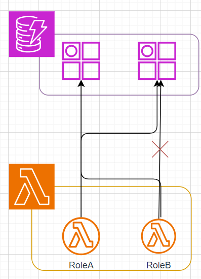
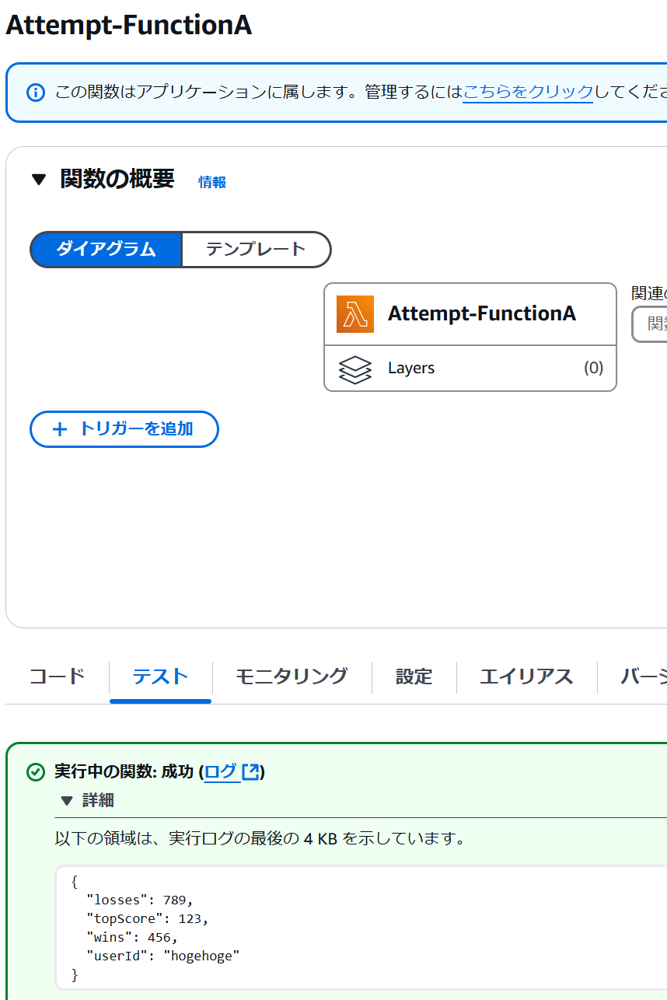
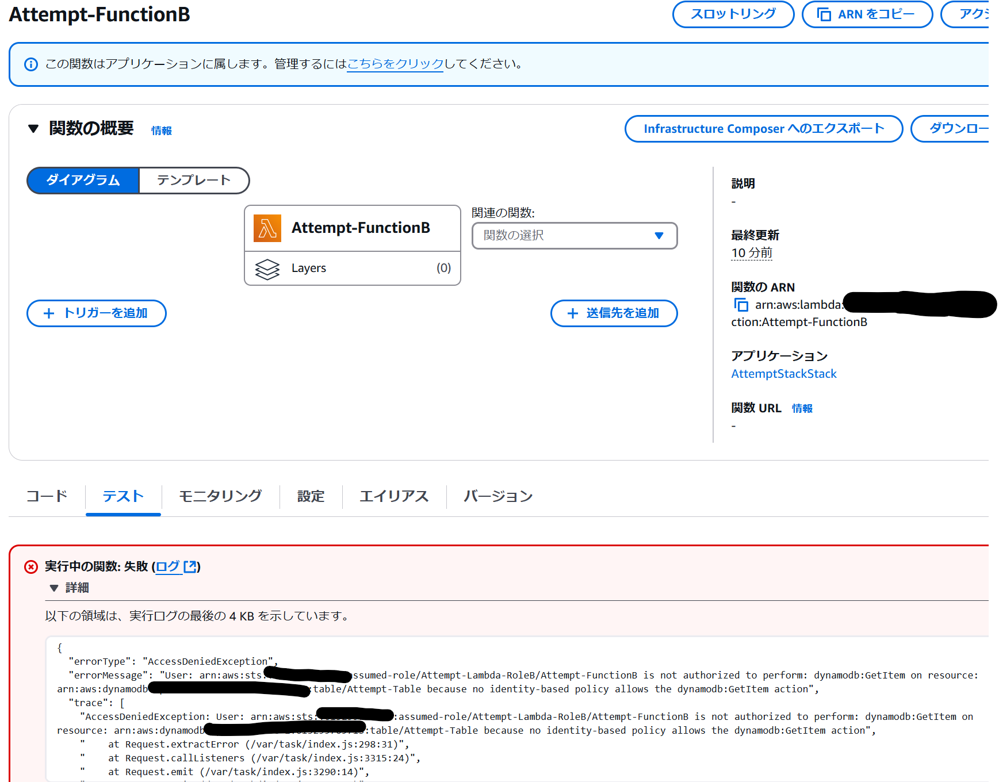
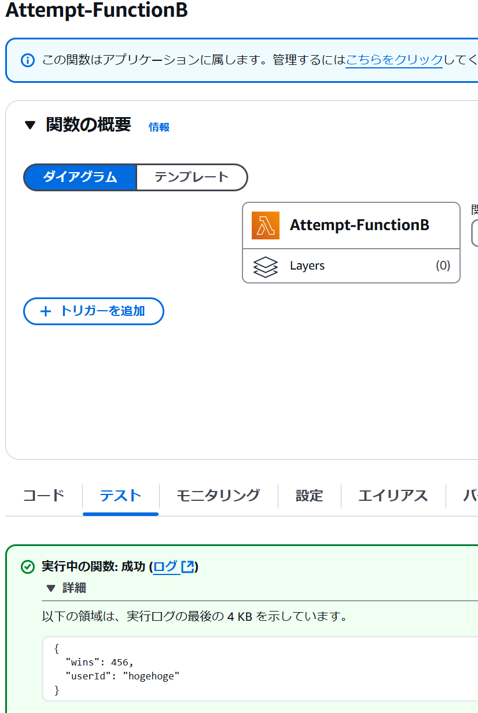

# 概要
こんにちは、クラスメソッド製造ビジネステクノロジー部の田中聖也です  
社内のAWS研修を受けて[DynamoDBにアクセスできる属性をIAMで制御するという機能](https://docs.aws.amazon.com/ja_jp/amazondynamodb/latest/developerguide/specifying-conditions.html)を知って、これってめっちゃ便利じゃないのかと思い、実際に使ってみて記事にすることにしました  

# IAMによるDynamoDBアクセス制御方法
1. DynamoDBテーブルにアクセスできるユーザーと、必要なアクセスレベルを特定します。実行する必要がある読み取りおよび書き込み操作を決定
2. DynamoDBへのアクセスを必要とするサービスと個人のIAMユーザー、グループ、またはロールを作成
3. IAMポリシーを作成し、IAMユーザーまたはロールにアタッチ

# やってみた
## アクセス制御例
| 属性 | RoleAの読み取り権限 | RoleBの読み取り権限 |
| userId | 〇 | 〇 |
| topScore | 〇 | × |
| wins | 〇 | 〇 |
| losses | 〇 | × |

〇 -> 読み取り可能
× -> 読み取り権限不可能
## 構成
以下のような構成とします  
左側のlambdaは特定の属性にアクセスできないようしています  
  

## CDK
```typescript:stack.ts
import * as cdk from 'aws-cdk-lib';
import { Construct } from 'constructs'
import { 
  aws_lambda,
  aws_lambda_nodejs,
  aws_iam,
  aws_dynamodb
 } from 'aws-cdk-lib';
 import { Duration } from 'aws-cdk-lib';

const PREFIX = 'Attempt';

export class AttemptStackStack extends cdk.Stack {
  constructor(scope: Construct, id: string, props?: cdk.StackProps) {
    super(scope, id, props);

    const table = new aws_dynamodb.Table(this, `${PREFIX}-Table`, {
      tableName: `${PREFIX}-Table`,
      partitionKey: { name: 'userId', type: aws_dynamodb.AttributeType.STRING },
      billingMode: aws_dynamodb.BillingMode.PAY_PER_REQUEST
    });

    const roleA = new aws_iam.Role(this, `${PREFIX}-RoleA`, {
      roleName: `${PREFIX}-Lambda-RoleA`,
      assumedBy: new aws_iam.ServicePrincipal('lambda.amazonaws.com'),
    });
    roleA.addToPolicy(new aws_iam.PolicyStatement({
      actions: ['dynamodb:GetItem'],
      resources: [table.tableArn],
      conditions: {
        StringEquals: {
          'dynamodb:Attributes': ['userId', 'topScore']
        }
      }
    }));

    const roleB = new aws_iam.Role(this, `${PREFIX}-RoleB`, {
      roleName: `${PREFIX}-Lambda-RoleB`,
      assumedBy: new aws_iam.ServicePrincipal('lambda.amazonaws.com')
    });
    // Note: RoleBはuserIdとwinsのみにアクセスできる
    roleB.addToPolicy(new aws_iam.PolicyStatement({
      effect: aws_iam.Effect.ALLOW,
      actions: ['dynamodb:GetItem'],
      resources: [table.tableArn],
      conditions: {
        "ForAllValues:StringEquals": {
          "dynamodb:Attributes": [
              "userId",
              "wins"
          ]
      },
        "StringEqualsIfExists": {
          "dynamodb:Select": "SPECIFIC_ATTRIBUTES"
      }
      }
    }));

    const handlerA = new aws_lambda_nodejs.NodejsFunction(this, `${PREFIX}-NodeFunctionA`, {
      functionName: `${PREFIX}-FunctionA`,
      runtime: aws_lambda.Runtime.NODEJS_20_X,
      entry: 'lambda/index.ts',
      handler: 'handler',
      timeout: Duration.seconds(75),
      environment: {
        TABLE_NAME: table.tableName,
      }
    });
    table.grantReadData(handlerA);

    const handlerB = new aws_lambda_nodejs.NodejsFunction(this, `${PREFIX}-NodeFunctionB`, {
      functionName: `${PREFIX}-FunctionB`,
      runtime: aws_lambda.Runtime.NODEJS_20_X,
      role: roleB,
      entry: 'lambda/index.ts',
      handler: 'handler',
      timeout: Duration.seconds(75),
      environment: {
        TABLE_NAME: table.tableName,
      }
    });
  }
}

```

## lambdaのソースコード
### lambdaBではエラーがでるversion
```typescript:error.ts
import * as AWS from 'aws-sdk';

const ddb = new AWS.DynamoDB.DocumentClient();

export const handler = async (event: any) => {
    console.info('event:', event);
    const tableName = process.env.TABLE_NAME;
    const userId = event.userId;

    try {
        if (!tableName || !userId) {
            throw new Error('Invalid parameters');
        }

        const data = await getUserInfo(ddb, tableName, userId);
        console.info('Get Data:', data);
        return data;
    } catch (error) {
        console.error('Error:', error);
        throw error;
    }
};

const getUserInfo = async (client: AWS.DynamoDB.DocumentClient, tableName: string, userId: string) => {
    try {
        const params = {
            TableName: tableName,
            Key: { userId }
        };

        const data = await client.get(params).promise();
        return data.Item;
    } catch (error) {
        console.error('Error:', error);
        throw error;
    }
};
```
#### 結果
##### lambdaA
lambdaAはread許可しているためエラーは発生しません  
  
##### lambdaB
lambdaBはuserIdとwinsのreadのみを許可するためエラーが発生します  
  

### lambdaBではエラー回避version
```typescript:error.ts
import * as AWS from 'aws-sdk';

const ddb = new AWS.DynamoDB.DocumentClient();

export const handler = async (event: any) => {
    console.info('event:', event);
    const tableName = process.env.TABLE_NAME;
    const userId = event.userId;

    try {
        if (!tableName || !userId) {
            throw new Error('Invalid parameters');
        }

        const data = await getUserInfo(ddb, tableName, userId);
        console.info('Get Data:', data);
        return data;
    } catch (error) {
        console.error('Error:', error);
        throw error;
    }
};

const getUserInfo = async (client: AWS.DynamoDB.DocumentClient, tableName: string, userId: string) => {
    try {
        const params = {
            TableName: tableName,
            Key: { userId },
            ProjectionExpression: 'userId, wins' // これを追加する
        };

        const data = await client.get(params).promise();
        return data.Item;
    } catch (error) {
        console.error('Error:', error);
        throw error;
    }
};
```
##### lambdaA
同様にエラーは発生しません  
  
##### lambdaB
lambdaBはuserIdとwinsのみをreadしているためエラーが発生しません    
  

# まとめ
IAMポリシーでDynamoDBにアクセスできる属性を制御してみました  
アプリケーションによってアクセスできる属性を制御したい時に使えますね