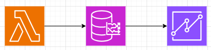
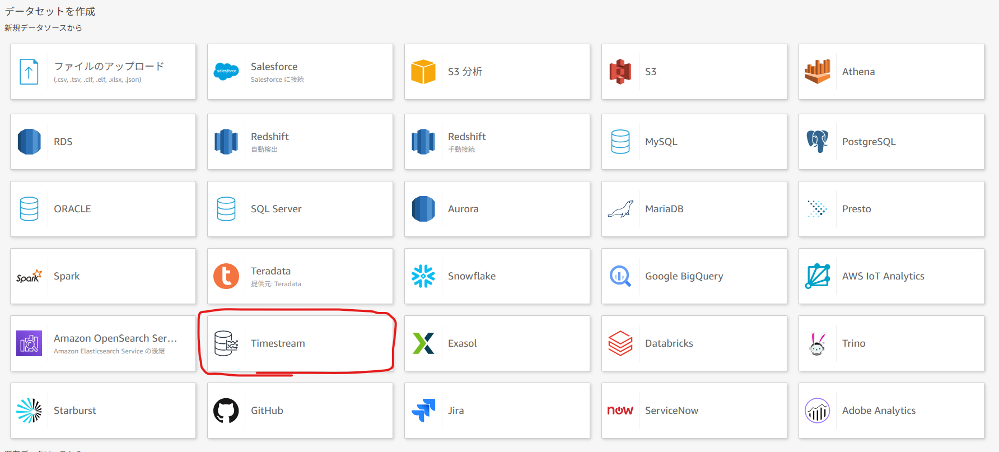
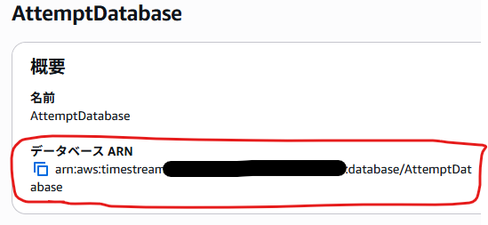
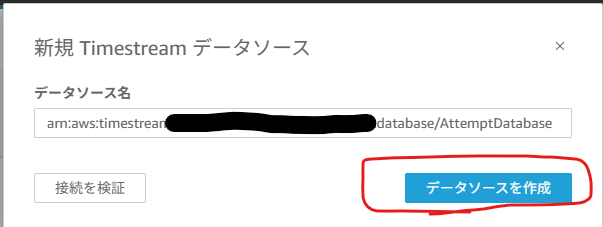
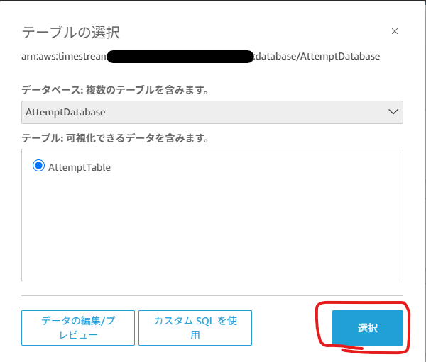
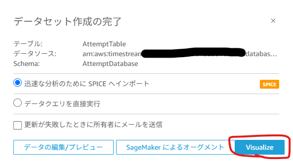
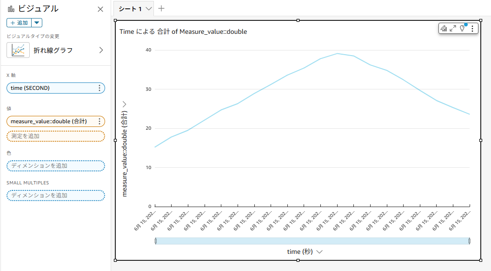

# 概要
こんにちは、クラスメソッド製造ビジネステクノロジー部の田中聖也です  
製造業では予知保全の一環で設備の電流や振動をIoTデバイス等で計測して異常値がないかを確認することがあります  
計測したデータを可視化する方法は複数ありますが、今回は[Amazon QuickSight](https://aws.amazon.com/jp/quicksight/?amazon-quicksight-whats-new.sort-by=item.additionalFields.postDateTime&amazon-quicksight-whats-new.sort-order=desc)で可視化してみました  
QuickSightのデータソースは[Amazon Timestream](https://aws.amazon.com/jp/timestream/)としました  


# やってみた
TimestreamにはLambdaでデータ投入します
## CDK
*TimestreamとLambdaのみです  
```typescript:stack.ts
import * as cdk from 'aws-cdk-lib';
import { Construct } from 'constructs'
import { 
  RemovalPolicy,
  aws_iot,
  aws_timestream,
  aws_iam,
  aws_lambda,
  aws_lambda_nodejs
 } from 'aws-cdk-lib';
import * as path from 'path';

const PREFIX = 'Attempt';

export class AttemptStack extends cdk.Stack {
  constructor(scope: Construct, id: string, props?: cdk.StackProps) {
    super(scope, id, props);

    // TimeStream Database
    const timestreamDatabase = new aws_timestream.CfnDatabase(this, `${PREFIX}TimeStreamDatabase`, {
      databaseName: `${PREFIX}Database`,
    });

    // TimeStream Table
    const timestreamTable = new aws_timestream.CfnTable(this, `${PREFIX}TimeStreamTable`, {
      databaseName: timestreamDatabase.ref,
      tableName: `${PREFIX}Table`,
      retentionProperties: {
        memoryStoreRetentionPeriodInHours: '24',
        magneticStoreRetentionPeriodInDays: '7'
      },
    });

    // Lambda Function for TimeStream Data Writing
    const timestreamWriterRole = new aws_iam.Role(this, `${PREFIX}LambdaTimestreamRole`, {
      assumedBy: new aws_iam.ServicePrincipal('lambda.amazonaws.com'),
      managedPolicies: [
        aws_iam.ManagedPolicy.fromAwsManagedPolicyName('service-role/AWSLambdaBasicExecutionRole')
      ],
      inlinePolicies: {
        TimestreamWritePolicy: new aws_iam.PolicyDocument({
          statements: [
            new aws_iam.PolicyStatement({
              effect: aws_iam.Effect.ALLOW,
              actions: [
                'timestream:WriteRecords',
                'timestream:DescribeEndpoints'
              ],
              resources: ['*']
            })
          ]
        })
      }
    });

    const timestreamWriterFunction = new aws_lambda_nodejs.NodejsFunction(this, `${PREFIX}TimestreamWriter`, {
      runtime: aws_lambda.Runtime.NODEJS_20_X,
      entry: 'lambda/index.ts',
      handler: 'handler',
      role: timestreamWriterRole,
      environment: {
        TIMESTREAM_DATABASE_NAME: timestreamDatabase.ref,
        TIMESTREAM_TABLE_NAME: timestreamTable.attrName,
        REGION: this.region
      },
      timeout: cdk.Duration.minutes(5)
    });
    }
}
```

## lambda
```typescript:index.ts
import { TimestreamWriteClient, WriteRecordsCommand, MeasureValueType, TimeUnit } from '@aws-sdk/client-timestream-write';

const timestreamClient = new TimestreamWriteClient({ region: process.env.AWS_REGION });

interface SampleData {
    deviceId: string;
    temperature: number;
}

export const handler = async (event: any) => {
    console.info('event:', event);
    
    try {
        
        const databaseName = process.env.TIMESTREAM_DATABASE_NAME;
        const tableName = process.env.TIMESTREAM_TABLE_NAME;
        
        if (!databaseName || !tableName) {
            throw new Error('Database name or table name is not configured');
        }
        
        // 現在時刻をベースにタイムスタンプを生成
        const baseTime = Date.now();
        
        // TimeStreamに書き込むレコードを準備
        const records = SAMPLE_DATA.map((data, index) => ({
            Dimensions: [
                {
                    Name: 'device_id',
                    Value: 'device-001'
                }
            ],
            MeasureName: 'sensor_data',
            MeasureValue: data.temperature.toString(), // TimeStreamのAPIでは、数値データでも文字列として送信する必要がある
            MeasureValueType: MeasureValueType.DOUBLE,
            Time: (baseTime + index * 1000).toString(), // 現在時刻から1秒間隔で動的に生成
            TimeUnit: TimeUnit.MILLISECONDS
        }));
        
        // TimeStreamにデータを書き込み
        const command = new WriteRecordsCommand({
            DatabaseName: databaseName,
            TableName: tableName,
            Records: records
        });
        
        const response = await timestreamClient.send(command);
        console.info('Successfully wrote records to TimeStream:', response);
        
        return {
            statusCode: 200,
            body: JSON.stringify({
                message: 'Successfully wrote records to TimeStream',
                recordsCount: records.length
            })
        };
        
    } catch (error) {
        console.error('Error writing to TimeStream:', error);
        return {
            statusCode: 500,
            body: JSON.stringify({
                message: 'Error writing to TimeStream',
                error: error instanceof Error ? error.message : 'Unknown error'
            })
        };
    }
};

const SAMPLE_DATA: SampleData[] = [
    { "deviceId": "device-001", "temperature": 15.2 },
    { "deviceId": "device-001", "temperature": 17.8 },
    { "deviceId": "device-001", "temperature": 19.5 },
    { "deviceId": "device-001", "temperature": 22.1 },
    { "deviceId": "device-001", "temperature": 24.7 },
    { "deviceId": "device-001", "temperature": 26.3 },
    { "deviceId": "device-001", "temperature": 28.9 },
    { "deviceId": "device-001", "temperature": 31.2 },
    { "deviceId": "device-001", "temperature": 33.6 },
    { "deviceId": "device-001", "temperature": 35.4 },
    { "deviceId": "device-001", "temperature": 37.8 },
    { "deviceId": "device-001", "temperature": 39.1 },
    { "deviceId": "device-001", "temperature": 38.5 },
    { "deviceId": "device-001", "temperature": 36.2 },
    { "deviceId": "device-001", "temperature": 34.8 },
    { "deviceId": "device-001", "temperature": 32.4 },
    { "deviceId": "device-001", "temperature": 29.7 },
    { "deviceId": "device-001", "temperature": 27.1 },
    { "deviceId": "device-001", "temperature": 25.3 },
    { "deviceId": "device-001", "temperature": 23.6 }
] 
```

## QuickSight
### データソースの追加
  
  
TimeStreamからデータベースを選択したArnをコピーする  
  
  
  
  
### ビジュアライズ
x軸をtime(秒)  
値はmeasure_valueにする  
  

# まとめ
TimeStreamをデータソースとしてQuickSightで可視化してみました  
QuickSightのデータソースは複数選択できて、マウス操作だけで自由に可視化できるので色々な場面で活用できそうですね!