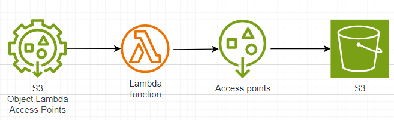
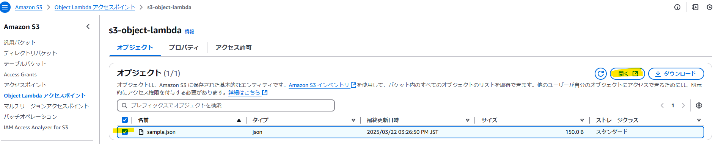
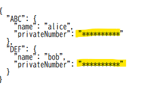

こんにちは、クラスメソッド製造ビジネステクノロジー部の田中聖也です  
社内のAWS研修を受けてS3 Object Lambdaアクセスポイントという機能を知って、これってめっちゃ便利じゃないのかと思い、実際に使ってみて記事にすることにしました  
# はじめに
## S3 Object Lambdaアクセスポイントとは
S3からデータを取り出す時にデータを加工して返却する機能です  
  
## ユースケース
- ECサイトでログインしていないユーザーには画像の解像度を下げたい
- 特定の部署がcsvファイルを取得するとC列の値はマスキングしたい

# やってみた
## ユースケースと構成図
### ユースケース
以下のようなjsonファイルをS3に配置します  
privateNumberを特定のユーザーが取得した場合のみマスキングするようにします  
```privateNumber.json
{
    "ABC": {
        "name": "alice",
        "privateNumber": "Abki56UIOO"
    },
    "DEF": {
        "name": "bob",
        "privateNumber": "Abki56UIOO"
    }
}
```
## コード関係
### CDK
```typescript:stack.ts
import * as cdk from 'aws-cdk-lib';
import { Construct } from 'constructs'
import { 
  aws_s3,
  RemovalPolicy,
  aws_lambda,
  aws_lambda_nodejs,
  aws_s3_deployment,
  aws_iam
 } from 'aws-cdk-lib';
 import * as s3ObjectLambda from 'aws-cdk-lib/aws-s3objectlambda';
 import { Duration } from 'aws-cdk-lib';

const PREFIX = 'Attempt';

export class AttemptStackStack extends cdk.Stack {
  constructor(scope: Construct, id: string, props?: cdk.StackProps) {
    super(scope, id, props);

    const bucket = new aws_s3.Bucket(this, `${PREFIX}-Bucket`, {
      bucketName: `${this.account}-attempt-bucket`,
      autoDeleteObjects: true, // stackが削除されたときにバケットが自動削除される
      removalPolicy: RemovalPolicy.DESTROY
    });

    const handler = new aws_lambda_nodejs.NodejsFunction(this, `${PREFIX}-NodeFunction`, {
      functionName: `${PREFIX}-Function`,
      runtime: aws_lambda.Runtime.NODEJS_20_X,
      entry: 'lambda/index.ts',
      handler: 'handler',
      timeout: Duration.seconds(75),
      environment: {
        BUCKET_NAME: bucket.bucketName,
        KEY: 'sample.json'
      }
    });

    // lambdaに権限設定
    bucket.grantRead(handler);
    // Note: これが重要
    handler.addToRolePolicy(new aws_iam.PolicyStatement({
      effect: aws_iam.Effect.ALLOW,
      actions: ['s3-object-lambda:WriteGetObjectResponse'],
      resources: ['*'],
    }));

    const accessPoint = new aws_s3.CfnAccessPoint(this, `${PREFIX}-AccessPoint`, {
      bucket: bucket.bucketName,
      name: 'access-point',
      publicAccessBlockConfiguration: {
        blockPublicAcls: true,
        blockPublicPolicy: true,
        ignorePublicAcls: true,
        restrictPublicBuckets: true
      }
    });

    new s3ObjectLambda.CfnAccessPoint(this, `${PREFIX}-LambdaAccessPoint`, {
      name: 's3-object-lambda',
      objectLambdaConfiguration: {
        supportingAccessPoint: accessPoint.attrArn,
        transformationConfigurations: [{
          actions: ['GetObject'],
          contentTransformation: {
            'AwsLambda': {
              'FunctionArn': handler.functionArn
            }
          }
        }]
      }
    });

    // Note: S3に手作業upが面倒なので追加しているだけです。本来は必要ないです
    new aws_s3_deployment.BucketDeployment(this, `${PREFIX}-AssetDeployment`, {
      sources: [aws_s3_deployment.Source.asset('./assets')],
      destinationBucket: bucket,
    });
  }
}

```
### Lambda
```typescript:index.ts
import * as AWS from 'aws-sdk';

const s3 = new AWS.S3();

export const handler = async (event: any) => {
    console.info('event', event);
    const bucketName = process.env.BUCKET_NAME;
    const key = process.env.KEY;

    try {
        const params = {
            Bucket: bucketName,
            Key: key
        };

        const data = await s3.getObject(params).promise();
        const jsonData = JSON.parse(data.Body.toString('utf-8'));

        // Mask the privateNumber
        for (const key in jsonData) {
            if (jsonData[key].privateNumber) {
                jsonData[key].privateNumber = jsonData[key].privateNumber.replace(/./g, '*');
            }
        }

        const res = JSON.stringify(jsonData);

        await s3.writeGetObjectResponse({
            RequestRoute: event.getObjectContext.outputRoute,
            RequestToken: event.getObjectContext.outputToken,
            Body: res,
            ContentType: 'application/json'
        }).promise()

        return { statusCode: 200, body: res};
    } catch (error) {
        console.error('Error:', error);
        throw error;
    }
};
```
## 結果
本当にマスキングされているかを確かめます  
AWSのコンソールから作成したObject Lambdaアクセスポイントを開きます  
  
開くと以下のようになります  
  
きちんとprivateNumberがマスキングされていることが分かりました  
# まとめ
S3 Object Lambdaを使用すればマスキングされたファイルを別途作成することなくlambdaだけの処理で簡潔することが分かりました  
ファイルが増えると、その分、管理が難しくなるので、AWSの機能をドンドンつかって楽していきましょう  