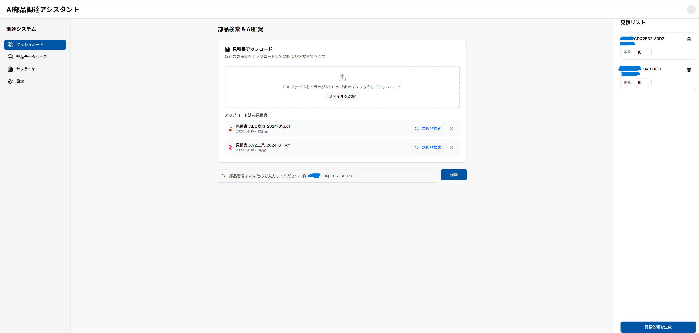
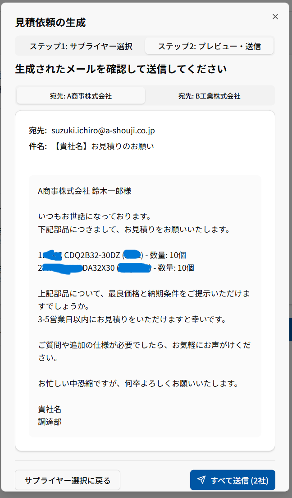
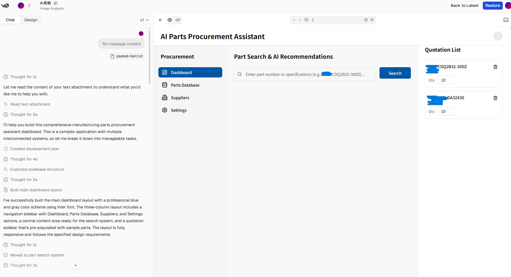

# 概要
こんにちは、クラスメソッド製造ビジネステクノロジー部の田中聖也です  
設備保全をしているとシリンダー等の部品の見積もりをとる機会が多いと思います  
会社によっては必ず相見積が必要な場合もあり、複数社に同じようなメールを送る場合もあります  
1回、1回の時間は小さいですが結構面倒な作業ですよね  
私も同じような経験があります  
今回はこんな問題を解決できるようなアプリのデモをVercel v0を使って爆速で開発してみました  

# 作ったデモアプリ
AIによって指定した製品の相見積メールを自動で作ってくれるアプリ「AI見積」です  
  
## ユースケース
### すでに過去の見積書がある
PDFをアップロードすれば、AIがOCRで型式を判断して同スペック品を探して提示してくれる
### 部品の型番は分かっている
型式を入力すれば、AIが同じメーカーの型式と同スペック品を提示してくれる

## 必要そうな機能
- [RAG技術](https://aws.amazon.com/jp/what-is/retrieval-augmented-generation/)を活用して各メーカーの電子カタログを読み込ませる  
- 型番等の情報から該当製品のスペック等を引っ張ってきて、違うメーカーの同スペック品を見積対象候補とする
- 商社やメーカーに送信するメールのたたき台を作ってくれる
- いつも取引している担当者のメールアドレスをcsv等で登録することができる
   
  
  

# やってみた
## 1. 仕様や機能をAIと洗い出す
頭に想像している内容をAIに教えてユースケース、機能を会話しながら教えていきます  
  
  
  
  
  

## 2. AIにVercel v0にデモアプリ作成を指示するプロンプトを作らせる
Vercel v0にもプロンプトが必要となりますが、AIとある程度、意思疎通ができているのでプロンプトもAIに作らせます  
  

## 3. Vercel v0にデモアプリを作成する
日本語化や足りない部分をやりとりします。今回は4回のやりとりで自分が欲しい機能が実装されていました  
  
  
  
  

# まとめ
生成AIを組み合わせて自分が過去に欲しかったデモアプリを作成してみました  
全ての工程を合算しても15分でここまでできました  
Vercel v0は初期のプロンプトが結構大切で、前端となる情報整理をAIと一緒にすることで、より早く正確にデモアプリが作れるのではないかと思いました