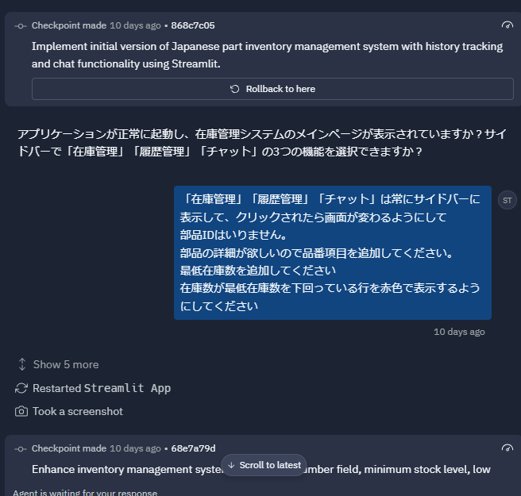
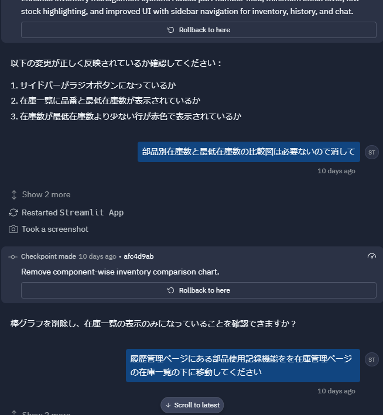
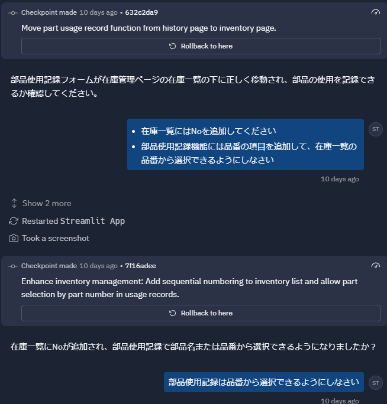
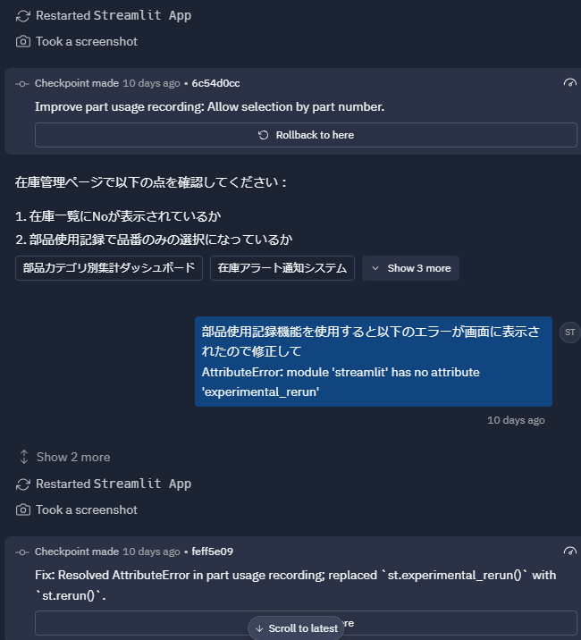
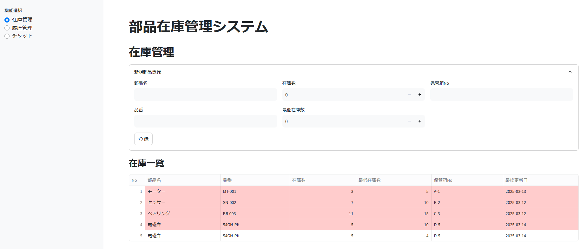
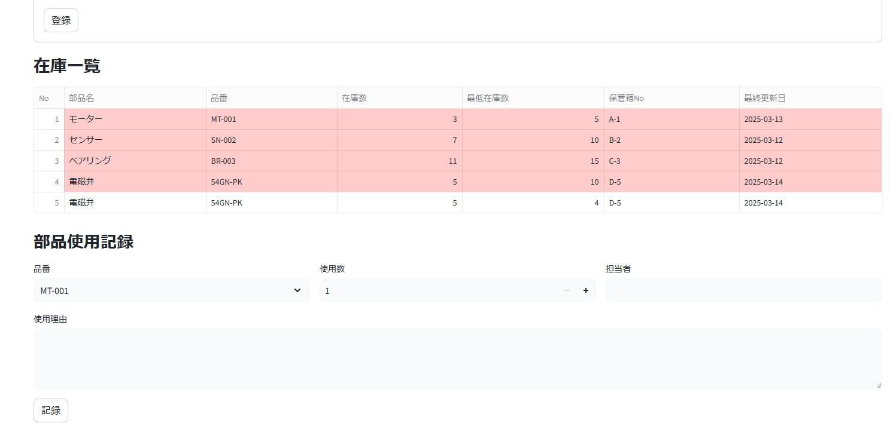
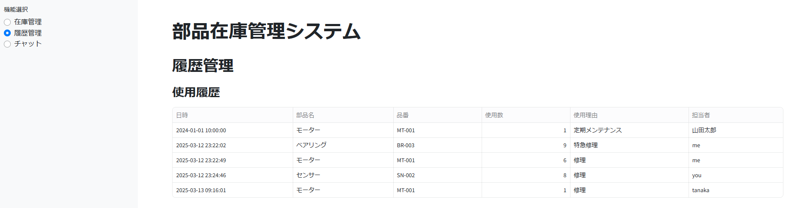
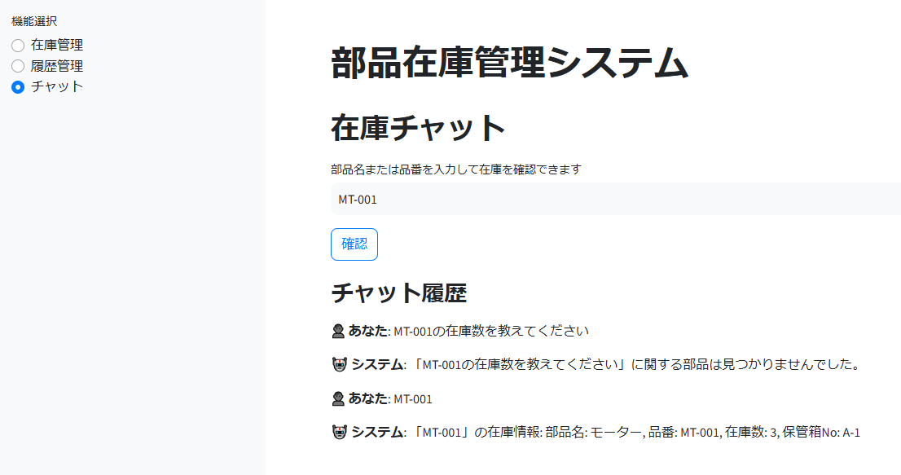

# 概要
こんにちは、クラスメソッド製造ビジネステクノロジー部の田中聖也です  
最近、[windsurf](https://codeium.com/windsurf)や[cursor](https://www.cursor.com/ja)など生成AI系のツールを使っています(この記事もwindsurfを使いながら書いています)  
先日、AI駆動開発(AI-Driven Development) 勉強会（第6回）にオンラインで参加しました  
そこで、[replit](https://replit.com/)というツールを知ったので実際に使ってみることにしました  

# 作ったもの
replitを使用して部品在庫管理システムを構築しました  
僕は新卒から5年間は製造業で設備保全をしていました  
設備保全のためには多くのパーツの予備品を保持しておく必要性があり、その部品在庫管理がかなり手間がかかって、「在庫管理できるツールがあればいいのに」と思っていたので、自分が欲しいものをAIに作らすことにしました  

## 手順
1. 解決した問題は分かっているので、それをマークダウンで書き出す(要件定義)
2. 手順1で作ったものをAIに投げて機能要件を作ってもらう
3. 手順2で作ったものをAIに投げてAIが解読しやすいプロンプトを生成してもらう
4. 手順3で作ったプロンプトをreplitで実装する(実装してもらう)
5. 動かしてみる
6. 直してほしい部分のやり取りをする
7. 手順5,6を繰り返して欲しいものに近づける

手順1で1時間ぐらい  
それ以降は手直しを含めて30分の計1時間30分である程度のものが完成しました!!  
しかも、手順4の1発目は5分ぐらいで上がってきました  

## 自分が作った要件定義
```markdown:要件定義.md
# システムの概要
生産設備の予備部品の在庫管理を行うシステム
最新の在庫状況やどの部品の何のために使用されたかを管理することができる
このソースコードは生成AIによって作成されています

# 業務の内容
## As Is
部品の保管ラックがある保管部屋に行く
紙で印刷された在庫表を確認
必要な部品が保管ラックにあることを確認する
在庫表に記載された保管箱Noを確認して、必要な数だけ部品を取る
取った分だけ在庫表の数を更新する(Excel)
更新した在庫表を印刷して古い在庫表と交換する
設備の保全実施報告書を記載する
## Issue
在庫表がExcelで管理されているため、事務所に戻る必要がある
在庫表の更新し忘れ
在庫表の在庫数と実際の箱に入っている部品の乖離
在庫表管理の工数が多い
## To Be
在庫管理の効率化: 在庫管理チャットで必要な部品の在庫があるかを確認できる。
在庫情報の提供: チャットから在庫数と保管箱Noが教えられる。
在庫表の自動更新: 取った部品の数だけ在庫表が自動で更新される。
## Solution 1st Step
### Solution
Webシステムの導入: 部品在庫一覧をWebで閲覧、編集できるようにする。
履歴管理: 在庫を使用した履歴を残す。
### Want
Webアクセス: 部品在庫一覧をWebから確認できる
履歴管理: 在庫を使用した履歴を記録する機能を持つ
```

## GPT4oが作った機能
```markdown:機能要件.md
# 部品在庫管理アプリケーション
## 概要
生産設備の予備部品の在庫管理を行うシステムを構築します。最新の在庫状況やどの部品が何のために使用されたかを管理することができます。

## 要件
Webシステムの導入: 部品在庫一覧をWebで閲覧、編集できるようにする。
履歴管理: 在庫を使用した履歴を残す。
## 機能
在庫管理の効率化: 在庫管理チャットで必要な部品の在庫があるかを確認できる。
在庫情報の提供: チャットから在庫数と保管箱Noが教えられる。
在庫表の自動更新: 取った部品の数だけ在庫表が自動で更新される。
## ソリューション
Webアクセス: 部品在庫一覧をWebから確認できる。
履歴管理: 在庫を使用した履歴を記録する機能を持つ。
## ステップ
フロントエンドとバックエンドの基本的なセットアップを行う。
部品在庫のCRUD機能を実装する。
在庫使用履歴の記録機能を実装する。
チャット機能を実装し、在庫情報を提供する。
テストとデプロイを行う。
## 各種条件
日本語で表示すること
```

## replitとのやり取り
  
  
  
  

## 実際に作ったもの
  
  
  
  

# まとめ
生成AIで自分が過去に欲しかったものを作ってみました  
機能的には足りなかったり、動作がイマイチな部分はありますがPoCで使ってみて初速を上げるのにはめっちゃいいと思います!! 