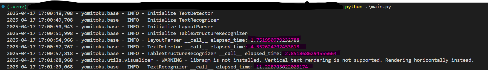
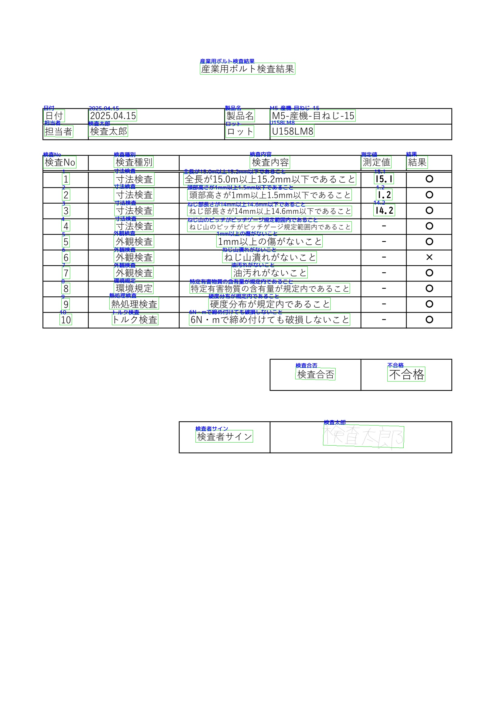

# 概要
こんにちは、クラスメソッド製造ビジネステクノロジー部の田中聖也です  
DXを進めていくなかでペーパーレス化も進んでいくと思います  
しかし、実際の現場では紙による日常点検簿や検査結果表が多く存在すると思います  
過去の紙データを電子化する方法として[OCR](https://mediadrive.jp/technology/ocr)があります  
今回はOCRライブラリの一つである日本語特化型の[YomiToku](https://github.com/kotaro-kinoshita/yomitoku)を利用して、検査結果表を読み込んでみたいと思います  
*Excelで大体の部分は書きましたが、最後の検査者サインだけ手書きにしてみました  

# やってみた
## pythonコード
GPUを積んでいないのでdeviceはcpuとしています
```python:main.py
from typing import Final

import cv2
from yomitoku import DocumentAnalyzer
from yomitoku.data.functions import load_pdf

IMAGE_PATH:Final[str] = "./検査結果サンプル.pdf"

if __name__ == "__main__":
    analyzer = DocumentAnalyzer(visualize=True, device="cpu")
    imgs = load_pdf(IMAGE_PATH)
    for i, img in enumerate(imgs):
        results, ocr_vis, layout_vis = analyzer(img)
        # HTML形式で解析結果をエクスポート
        results.to_html(f"output_{i}.html", img=img)
        # 可視化画像を保存
        cv2.imwrite(f"output_ocr_{i}.jpg", ocr_vis)
        cv2.imwrite(f"output_layout_{i}.jpg", layout_vis)
```

## 実行プロセス
  
最初の実行はinitProcessが発生しますが、実際の処理は結構速いですね

## 結果
  
凄いですね。ほぼ間違いなく、手書きの部分もしっかりと読み取れているのが確認できます  

# まとめ
日本語特化型のライブラリということで予想を超えた凄い精度でした  
過去の紙データも電子化することでRAGに繋げることができるかもですね  