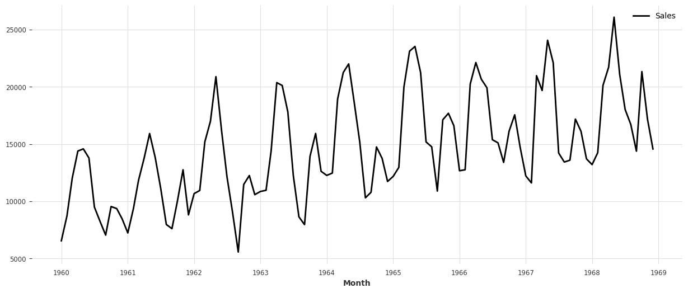
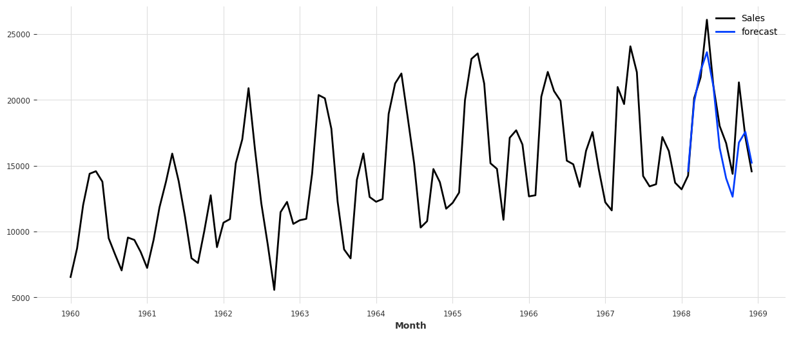

# 概要
こんにちは、クラスメソッド製造ビジネステクノロジー部の田中聖也です  
製造業に限らずですが、正確に自社製品の需要を予測できると様々なビジネス場面で有利になります  
製造業だと以下のような効果があります  
- 在庫管理の最適化
- 生産計画とスケジュールの改善
- 戦略的な意思決定の支援

過去のデータさえあれば人によって需要を予測することも出来ますが、AIを使って需要予測を実施することもできます  
今回はAIで月別自動車販売台数の予測をやってみました  
pythonの時系列予想ライブラリである[Darts](https://unit8co.github.io/darts/README.html)を使用しています  
データはオープンデータの[月別自動車販売台数](https://github.com/jbrownlee/Datasets)を利用することにしました

# やってみた
## 販売台数のプロット
今までの販売台数実績を時系列でplotしてみます
### ソースコード
```plot.py:python
from typing import Final

from darts import TimeSeries

# グラフを横長にする
from matplotlib.pylab import rcParams
rcParams['figure.figsize'] = 15, 6


DATA_PATH: Final[str] = "./data/monthly-car-sales.csv"

# pandasのDataFrameからでも読み込み可能
series = TimeSeries.from_csv(DATA_PATH, "Month", "Sales")
series.plot()
```
### プロット結果
  
上がり下がりはありますが、長期トレンドとしては上昇傾向であることがわかります  

## 販売台数予測
1968年までのデータを学習して1969年の販売台数を予測してみます  
予測モデルは以下3つのモデルを使用します  
- ARIMA
- ExponentialSmoothing
- BATS
### ソースコード
```pred.py:python
from darts.models import ( ARIMA,
                          ExponentialSmoothing,
                          BATS
                          )

# 学習データと予測データの分割
train_size = int((len(series))*0.9)
train, val = series[:train_size], series[train_size:]

# ExponentialSmoothing
exponetial = ExponentialSmoothing()
exponetial.fit(train)
exponetial_pred = exponetial.predict(len(val))

series.plot()
exponetial_pred.plot(label="forecast", low_quantile=0.05, high_quantile=0.95)
plt.legend()

# ARIMA
arima = ARIMA()
arima.fit(train)
arima_perd = arima.predict(len(val))

series.plot()
exponetial_pred.plot(label="forecast", low_quantile=0.05, high_quantile=0.95)
plt.legend()
```

### 予測結果
どちらもボチボチの精度で予測できているのが確認できました
#### ExponentialSmoothing

#### ARIMA
  

# まとめ
今回は時系列予想ライブラリであるDartsを使用して**月別自動車販売台数**を予測してみました  
あくまでplotしただけの感覚的な精度でありますが、ボチボチの精度であることが確認できました  
次回はMAPEなどの精度指標を使用して定量的にモデルの精度を比較したり、外部データを使用して精度を上げることをしていきたいと思います  