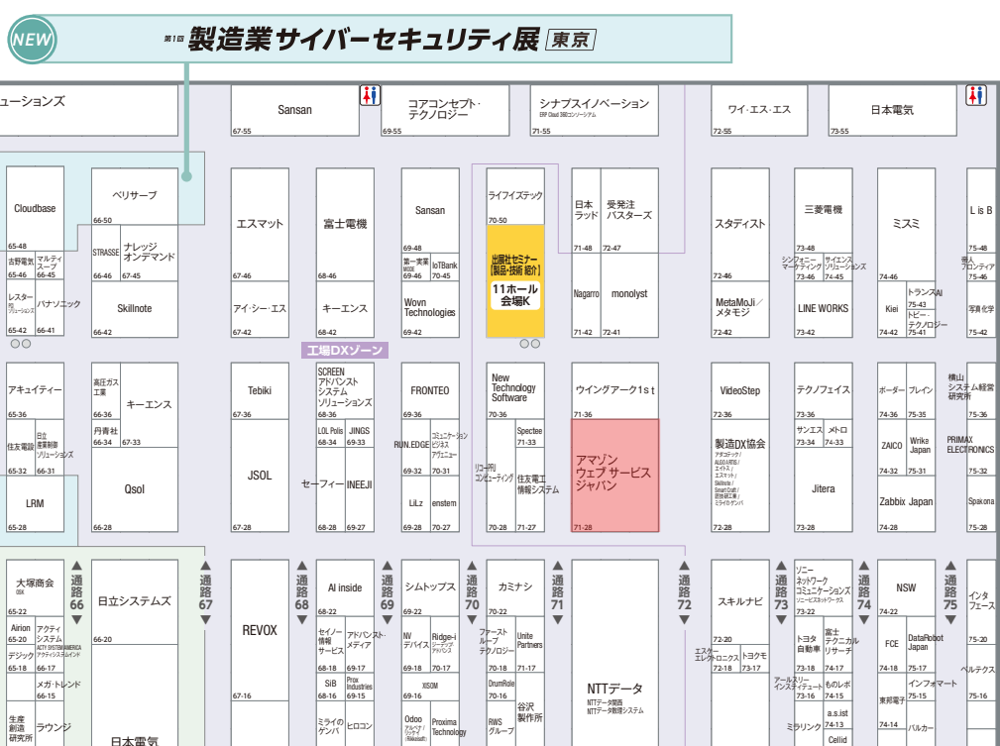

# クラスメソッド株式会社、ものづくりワールドin東京 2025 に初出展！
クラスメソッド株式会社は、この度「ものづくりワールドin東京 2025」に初出展いたします。  
「クラスメソッドが製造業??」と不思議な顔をしたあなた!!  
クラスメソッドは製造業を中心とした顧客の課題を解決するための「製造ビジネステクノロジー部」という部があるのです!!　　
製造業の皆様の課題解決に貢献する、当社の革新的なソリューションを展示しておりますので是非、当ブースに足を運んでください!!

## 出展内容：PLC Data To Cloud 
今回の展示では、工場などに設置されたPLC(Programmable Logic Controller)データをクラウドに保存し、可視化、分析、通知を行うソリューション「[PLC Data To Cloud](https://classmethod.jp/services/iot/plc/)」を展示してります。  
展示物は実際に工場で使用されていそうな設備を用意しておりますので、PLC Data To Cloudが実務にどのよう活かせそうかを体感してもらえるかと思います!!

### PLC Data To Cloud とは？
「PLC Data To Cloud」は、工場内などに設置されたPLCデータをクラウドに保存し可視化、分析、通知を行うソリューションです。
これにより、以下のメリットを提供します。

* **PLCとクラウドが簡単につながる**: GatewayをPLCに接続するだけでPLC データのクラウド送信が可能です
* **データの可視化**: 生産状況や設備の稼働状況をリアルタイムでダッシュボードに表示し、どこからでも工場の状態を把握できます
* **高度な分析**: 蓄積されたデータを分析することで、生産効率の向上、品質改善、予知保全、需要予測などに役立てることができます。データウェアハウスやBIツールとの連携、AIを活用したデータ活用も可能です

## 出展場所
AWS(アマゾンウェブサービスジャパン合同会社)様との共同出展となりますので、是非、AWSブースに足を運んでください!!

## ものづくりワールドin東京 2025 開催概要

ぜひこの機会に、クラスメソッドのブースへお越しいただき、「PLC Data To Cloud」ソリューションのデモンストレーションをご覧ください。弊社のエンジニアが、お客様の製造現場のデジタル変革をサポートするための具体的な方法をご提案いたします。

* **イベント名**: ものづくりワールin東京 2025
* **会期**: 2025年7月9日(水)~2025年7月11日(金)
* **会場**: 幕張メッセ

皆様のご来場を心よりお待ちしております。

### 関連リンク
* ものづくりワールド [東京] 2025 公式サイト: [ものづくり ワールド [東京] 2025｜日本最大級の製造業の展示会](https://www.manufacturing-world.jp/tokyo/ja-jp.html)
* Classmethod PLC Data To Cloud 詳細: [Classmethod PLC Data To Cloud | IoT | クラスメソッド株式会社](https://classmethod.jp/services/iot/plc/)