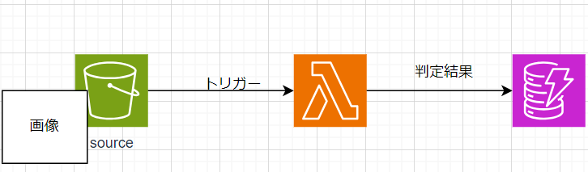
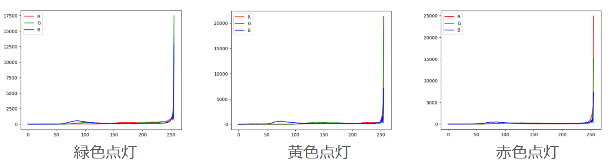
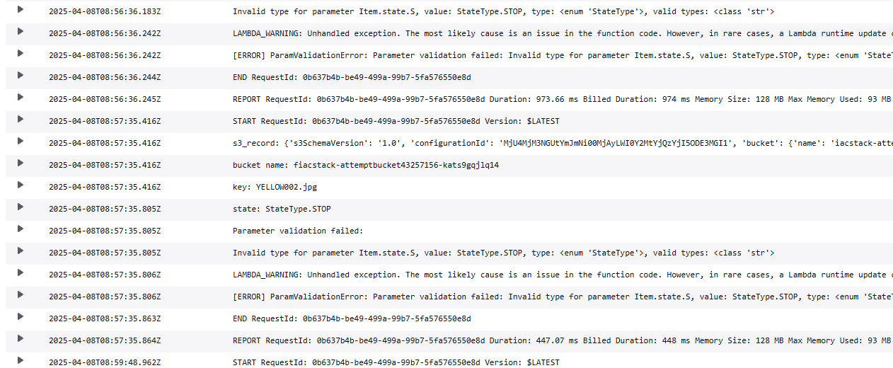
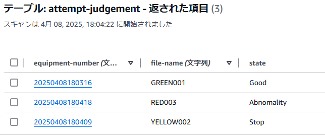

# 概要
こんにちは、クラスメソッド製造ビジネステクノロジー部の田中聖也です
製造業では音や振動、画像など様々な情報で設備の異常や状態を検知できたりします  
検知にはAI(人工知能)モデルを使うことが多いですが、実際に現場で使用を検討するとメモリ等のマシンスペックが問題となり適用できない場合がありまる  
今回はAIを使用せずに色情報のみで状態の検知ができるかをやってみました  
工場でよく見る[積層信号灯](https://www.patlite.co.jp/product/category2.html)の画像から「正常」、「停止」、「異常」を判断したいと思います  
点灯している色と設備の状態は以下の対応としました  
| 積層信号灯の点滅している色 | 設備状態 |
| :-- | :-- |
| 緑色 | 正常 |
| 黄色 | 停止 |
| 赤色 | 異常 |

*積層信号灯の画像データはADFIの[Rotary beacon light](https://adfi.jp/ja/download/)を使用しました  

# 構成
1. S3にアップロードされた画像をLambdaで判定して
2. 判定結果をDynamoDBに保存
  
  

## DynamoDBの内容
| equipment-number | file-name | state |
| :-- | :-- | :-- |
| HY001 | 20250325120000 | normal |
| HY001 | 20250325120100 | normal |
| HY001 | 20250325120200 | stop |

equipment-number: 設備番号  
file-name: YYYYMMDDhhmmss  
state: normal, stop, abnormalityのいずれか  
  
*equipment-numberは光っている色を含めることにしました(DynamoDBで結果を確認しやすくするため)

# 色情報から状態判定のロジックを決める
## 色情報のヒストグラムを確認
各色点灯時のRGBのヒストグラムを可視化するとこんな感じでした  
  
## 判定ロジック
1. RGBのヒストグラムを取得
2. RGBの一番最終値の値を取得
3. 大きい順でソート
4. G成分が一番大きい場合「正常」と判断
5. R成分が一番大きい & G成分と5000以上の差があれば「異常」と判断
6. 手順4,5以外の条件であれば「停止」と判断

# やってみた
## CDK
```stack.py:python
from typing import Final

from aws_cdk import (
    Stack,
    aws_s3,
    aws_dynamodb,
    aws_lambda,
    RemovalPolicy,
)
from aws_cdk.aws_lambda_event_sources import S3EventSource
from constructs import Construct

PREFIX: Final[str] = "Attempt"

class IacStack(Stack):

    def __init__(self, scope: Construct, construct_id: str, **kwargs) -> None:
        super().__init__(scope, construct_id, **kwargs)

        bucket:aws_s3.Bucket = aws_s3.Bucket(
            self, id=f"{PREFIX}-Bucket",
            removal_policy=RemovalPolicy.DESTROY,
            auto_delete_objects=True
        )

        dynamo_db:aws_dynamodb.Table = aws_dynamodb.Table(
            self, id=f"{PREFIX}-Judgement-Table",
            table_name=f"{PREFIX}-Judgement".lower(),
            partition_key=aws_dynamodb.Attribute(
                name="equipment-number",
                type=aws_dynamodb.AttributeType.STRING
            ),
            sort_key=aws_dynamodb.Attribute(
                name="file-name",
                type=aws_dynamodb.AttributeType.STRING
            ),
            billing_mode=aws_dynamodb.BillingMode.PROVISIONED,
            removal_policy=RemovalPolicy.DESTROY,
        )

        <!-- 色々と試したがlayerが出来ないので外部のやつを使用 -->
        layer = aws_lambda.LayerVersion.from_layer_version_arn(
            self, f"{PREFIX}-Layer",
            layer_version_arn=f"arn:aws:lambda:{self.region}:770693421928:layer:Klayers-p312-Pillow:5"
        )

        handler:aws_lambda.Function = aws_lambda.Function(
            self, id=f"{PREFIX}-Handler",
            function_name=f"{PREFIX}-Handler",
            code=aws_lambda.Code.from_asset("lambda"),
            handler="index.handler",
            runtime=aws_lambda.Runtime.PYTHON_3_12,
            layers=[layer],
            environment={
                "TABLE_NAME": dynamo_db.table_name
            }
        )

        bucket.grant_read(handler)
        dynamo_db.grant_read_write_data(handler)

        handler.add_event_source(
            S3EventSource(bucket=bucket, events=[aws_s3.EventType.OBJECT_CREATED_PUT])
        )

```
## Lambda
```index.py:python
from enum import StrEnum
import os
import urllib.parse
import datetime

from PIL import Image
import boto3

# クライアント
s3_clinet = boto3.client('s3')
dynamodb_client = boto3.client('dynamodb')

# 現在時刻をファイル名にするため処理
t_delta = datetime.timedelta(hours=9)
JST = datetime.timezone(t_delta, 'JST')

# 設備状態を定義
class StateType(StrEnum):judge
    GOOD = "Good"
    STOP = "Stop"
    ABNORMALITY = "Abnomality"


def handler(event, context):
    now = datetime.datetime.now(JST)
    s3_record = event["Records"][0]["s3"]
    print(f"s3_record: {s3_record}")
    
    bucket_name: str = s3_record["bucket"]["name"]
    key: str = urllib.parse.unquote_plus(s3_record["object"]["key"], encoding="utf-8")
    print(f"bucket name: f{bucket_name}")
    print(f"key: {key}")

    source_file = u'/tmp/' + os.path.basename(key)
    file_name = now.strftime('%Y%m%d%H%M%S')

    try:
        s3_clinet.download_file(Bucket=bucket_name, Key=key, Filename=source_file)
        image = Image.open(source_file, 'r')
        color_value_dict = get_last_hist_value(image=image)
        state:StateType = pred_state(color_value_dict)
        print(f"state: {state}")
        dynamodb_client.put_item(
            TableName=os.environ["TABLE_NAME"],
            Item={
                "equipment-number": {
                    "S": file_name
                },
                "file-name": {
                    "S": key.replace(".jpg", "")
                },
                "state": {
                    "S": state
                }
            }
        )

    except Exception as e:
        print(e)
        raise e

    return {}


def get_last_hist_value(image) -> dict:
    hist_dict = dict()
    hist = image.histogram()
    hist_dict["R"] = hist[:256]
    hist_dict["G"] = hist[256:512]
    hist_dict["B"] = hist[512:]

    hist_last_value_dict = {"R": hist_dict["R"][-1],
                            "G": hist_dict["G"][-1],
                            "B": hist_dict["B"][-1]}
    
    return hist_last_value_dict

def pred_state(color_value_dict: dict):
    # 大きい順に並び替え
    sorted_value_dict = sorted(color_value_dict.items(), key=lambda x:x[1], reverse=True)

    if sorted_value_dict[0][0] == "G":
        return StateType.GOOD
    
    # GreenとRedの成分を比較
    red_value = sorted_value_dict[0][1]
    green_value = sorted_value_dict[1][1]
    # 差が大きければgood, それ以外であればstop
    diff_value = red_value - green_value
    if diff_value > 5000:
        return StateType.ABNORMALITY
    else:
        return StateType.STOP
```
## 結果
### Lambda Log
  
warningがめっちゃ出てますが、時間がある時に直します。。。  
### DynamoDB
  
それぞれの色をきちんと判断できているようです  
# まとめ
AIを使用せず色だけでロジックを組むことで積層信号灯の色を判断することができました  
## 微妙につまったとこ
lambdaでpillowを使うためにlambda layerを作っても上手くライブラリをインポートできませんでした  
結局、[公開されているレイヤー](https://api.klayers.cloud/api/v2/p3.12/layers/latest/ap-northeast-1/html)を今回は使用することにしました  
時間があれば、原因を調査したいです  